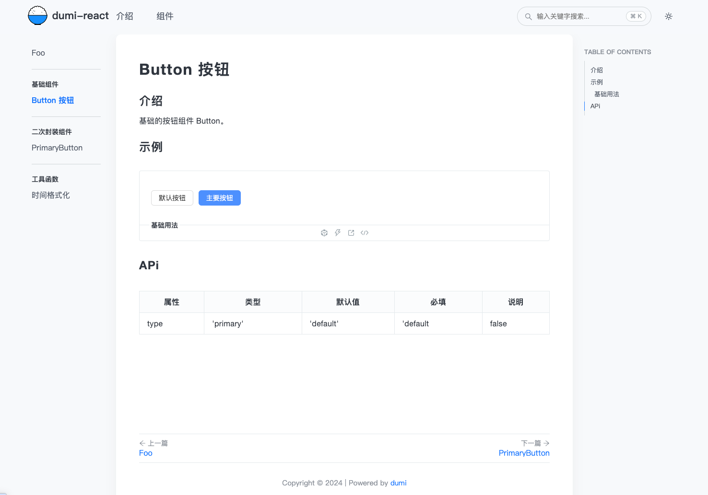

# Dumi搭建 React组件库/基于Antd二次封装

## Dumi介绍 移步 [官网](https://d.umijs.org/)

## 环境准备
  1. 安装Node.js  
  ```js
  // node>=20.0.0
  node -v
  v20.9.0
  ```
  2. 创建项目
  > 
  
  ```js
  mkdir dumi-demo && cd dumi-demo

  ```
  > 通过官方工具创建项目

  ```js
  npx create-dumi
  ```
  
    - 在进行模版类型的时候我们选择React Library模版。
    - 可以开发组件和生成静态站点文档，其他的是选择npm管理工具。
    - 包名称、描述、邮箱、作者，按自己情况来输入就好了。
    - 这里包名称输入的是【项目名/dumi-demo】后期需要发布npm。

  3. 启动项目
  ```js
  npm start
  //or
  yarn start
  ```
  4. 目录结构
  ```js
  ├── docs               # 组件库文档目录
  │   ├── index.md       # 组件库文档首页
  │   ├── guide.md       # 组件库其他文档路由表（示意）
  │   │   ├── index.md
  │   │   └── help.md
  ├── src                # 组件库源码目录
  │   ├── Button         # 单个组件
  │   │   ├── index.tsx  # 组件源码
  │   │   ├── index.less # 组件样式
  │   │   └── index.md   # 组件文档
  │   └── index.ts       # 组件库入口文件
  ├── .dumirc.ts         # dumi文档的配置文件
  └── .fatherrc.ts       # 组件库打包npm包的配置文件

  ```
  5. 完善项目
  > 如果样式有不是想要的可以根据类名覆盖原有样式 可以在`.dumirc.ts`文件中配置
  ```js
  import { defineConfig } from 'dumi';

  export default defineConfig({
  styles: [
    `.dumi-default-header-left {
        width: 220px !important;
    }`,
  ],
  });

  ```
  修改Foo选项为组件库，在.dumirc.ts文件中添加配置:

  ```js
  import { defineConfig } from 'dumi';

  export default defineConfig({
    // ...
    themeConfig: {
      name: 'dumi2-demo',
      nav: [
        { title: '介绍', link: '/guide' },
        { title: '组件', link: '/components/Foo' }, // components会默认自动对应到src文件夹
      ],
    },
  });

  ```
  调整后的页面
  


## 基础组件开发
  1. 添加组件源代码
  > 新增Button组件
  ```js
  mkdir src/Button && touch src/Button/index.tsx
  ```
  ```js
  //  src/Button/index.tsx
  import React, { memo } from 'react';
  import './styles/index.less' // 引入样式
  export interface ButtonProps {
    /** 按钮类型 */
    type?: 'primary' | 'default';
    /** 按钮文字 */
    children?: React.ReactNode;
    onClick?: React.MouseEventHandler<HTMLButtonElement>
  }

  /** 按钮组件 */
  const Button: React.FC<ButtonProps> = (props) => {
    const { type = 'default', children, onClick } = props
    return (
      <button
        type='button'
        className={`dumi-btn ${type ? 'dumi-btn-' + type : ''}`}
        onClick={onClick}
      >
        {children}
      </button>
    );
  };

  export default memo(Button);

  ```
  2. 添加全局主题less样式和变量
  > 在src下创建variables.less文件
  ```js
  touch src/variables.less
  ```
  ```js
  // src/variables.less
  @dumi-primary: #4d90fe; // 主题颜色

  ```
  3. 单组件添加less样式
  ```js
  mkdir src/Button/styles && touch src/Button/styles/index.less
  ```
  ```js
  // src/Button/styles/index.less
  @import '../../variables.less';

  .dumi-btn {
    font-size: 14px;
    height: 32px;
    padding: 4px 15px;
    border-radius: 6px;
    transition: all .3s;
    cursor: pointer;
  }

  .dumi-btn-default {
    background: #fff;
    color: #333;
    border: 1px solid #d9d9d9;

    &:hover {
      color: @dumi-primary;
      border-color: @dumi-primary;
    }
  }

  .dumi-btn-primary {
    color: #fff;
    background: @dumi-primary;
    border: 1px solid @dumi-primary;
  }
  ```
  4. 组件导入
  > 组件源代码添加好后，需要在src/index.ts中引入后暴露一下：
  ```js
  // src/index.ts
  export { default as Button } from './Button';

  ```
  5. 添加演示demo
  每一个组件我们可以加一个demo示例，方便使用者能更方便的使用
  > 在Button目录下新建一个demo文件夹，内建一个基础演示base.tsx文件:
  ```js
  mkdir src/Button/demo && touch src/Button/demo/base.tsx
  ```
  演示代码：
  ```javascript
  // src/Button/demo/base.tsx

  import React from 'react';
  import { Button } from 'dumi2-demo';

  export default () => {

    return (
      <>
        <Button type="default">默认按钮</Button> &nbsp;
        <Button type="primary">主要按钮</Button>
      </>
    );
  }
  ```
  6. 添加组件使用文档

  ```js
  touch src/Button/index.md

  ```

  ```js
  ---
  category: Components
  title: Button 按钮 # 组件的标题，会在菜单侧边栏展示
  toc: content # 在页面右侧展示锚点链接
  group: # 分组
    title: 基础组件 # 所在分组的名称
    order: 1 # 分组排序，值越小越靠前
  ---

  # Button 按钮

  ## 介绍

  基础的按钮组件 Button。

  ## 示例 

  <!-- 可以通过code加载示例代码，dumi会帮我们做解析 -->
  <code src="./demo/base.tsx">基础用法</code>

  ## APi

  <!-- 会生成api表格 -->
  | 属性 | 类型                   | 默认值   | 必填 | 说明 |
  | ---- | ---------------------- | -------- | ---- | ---- |
  | type | 'primary' | 'default' | 'default |  false  | 按钮类型 |

  ```
  

  7. 添加单元测试

  添加好基础组件后，通常需要加上给组件添加测试代码，来保障组件的健壮性。
  测试框架采用react最常用的jest工具，再配合react配套的单元测试库，安装依赖
  ```js
  npm i jest @testing-library/react @types/jest ts-jest jest-environment-jsdom jest-less-loader typescript@4 -D
  ```
  - Jest: jest单元测试核心库
  - @testing-library/react：React的测试工具库，在React应用中进行单元测试、集成测试和端到端测试。
  - @types/jest：jest的类型。
  - ts-jest：让jest支持ts语法的预设。
  - jest-environment-jsdom: jest的测试环境，使用js-dom库模拟dom环境，默认是node环境。
  - jest-less-loader: jest不认识less和css，使用该插件使jest支持less和css。
  - tytpescript: 这是安装了4版本，最新的5版本会有警告

  装好依赖后在项目根目录新建jest的配置文件jest.config.js
  ```js
  touch jest.config.js
  ```
  ```javascript
  /** @type {import('ts-jest').JestConfigWithTsJest} */
  module.exports = {
    preset: 'ts-jest', // 使用ts-jest预设，支持用ts写单元测试
    testEnvironment: 'jsdom', // 设置测试环境为jsdom环境
    roots: ['./src'], // 查找src目录中的文件
    collectCoverage: true, // 统计覆盖率
    coverageDirectory: 'coverage', // 覆盖率结果输出的文件夹
    transform: {
      '\.(less|css)$': 'jest-less-loader' // 支持less
    },
    // 单元覆盖率统计的文件
    collectCoverageFrom: ['src/**/*.tsx', 'src/**/*.ts', '!src/index.ts', '!src/**/demo/*'],
  };
  ```
  8. 编写单元测试

  在Button目录下新建一个__tests__文件夹放置单元测试代码，在里面新建index.test.tsx。

  ```js
  mkdir src/Button/__tests__ && touch src/Button/__tests__/index.test.tsx

  ```

  测试代码：
  ```js
  // src/Button/__tests__/index.test.tsx

  import React from 'react';
  import { render, fireEvent } from '@testing-library/react';
  import Button from '..';

  describe('Button组件', () => {
    it('能够正确渲染按钮文字', () => {
      const buttonText = '按钮文字';
      const { getByRole } = render(<Button>{buttonText}</Button>);
      const buttonElement = getByRole('button');
      expect(buttonElement.innerHTML).toBe(buttonText);
    });

    it('能够正确渲染默认样式的按钮', () => {
      const { getByRole } = render(<Button >默认按钮</Button>);
      const buttonElement = getByRole('button');
      expect(buttonElement.classList.contains('dumi-btn')).toBe(true);
    });

    it('能够正确渲染主要样式的按钮', () => {
      const { getByRole } = render(<Button type="primary">主要按钮</Button>);
      const buttonElement = getByRole('button');
      expect(buttonElement.classList.contains('dumi-btn-primary')).toBe(true);
    });

    it('能够触发点击事件', () => {
      const handleClick = jest.fn();
      const { getByRole } = render(<Button type="primary" onClick={handleClick}>点击按钮</Button>);
      const buttonElement = getByRole('button');
      fireEvent.click(buttonElement);
      // 断言函数被调用了一次。
      expect(handleClick).toHaveBeenCalledTimes(1);
    });
  });
  ```

  保存后在命令行执行npx jest执行一下单元测试:

  ```js
  npx jest
  ```
  > jest会自动寻找目录中__tests__文件夹，去执行内部以.test.{js, jsx, ts, tsx}结尾的文件。

  
  ::: tip 测试报告
  可以看到执行了Button组件的单元测试，并且最后生成了测试报告，标注了测试了哪些文件，每个文件的覆盖率，测试情况。
  并且会在项目根目录下生成测试报告的静态站点coverage文件夹，在浏览器打开`coverage/lcov-report/index.html`文件，
  即可看到测试报告，通过对每个文件的分析，可以看到有哪些单元测试没覆盖到的地方，可以帮助我们更好的写单元测试。
  :::


## antd二次封装
  1. 新增antd 组件代码
  ```js
  npm i antd -D
  ```
  在src下新建一个PrimaryButton文件夹，内建index.tsx

  ```js
  mkdir src/PrimaryButton && touch src/PrimaryButton/index.tsx
  ```

  ```js
  // src/PrimaryButton/index.tsx
  import React, { memo } from "react";
  import { Button, ButtonProps } from "antd";

  type IPrimaryButtonProps = Omit<ButtonProps, 'type'>

  const PrimaryButton: React.FC<IPrimaryButtonProps> = (props) => {

    const { children, ...rest } = props

    return (
      <Button {...rest} type='primary'>
        {children}
      </Button>
    );
  };

  export default memo(PrimaryButton);
  ```
  组件源代码添加好后，需要在src/index.ts中引入后暴露一下：

  ```js
  // src/index.ts
  export { default as PrimaryButton } from './PrimaryButton';
  ```

  2. 添加demo示例

  ```js
  mkdir src/PrimaryButton/demo && touch src/PrimaryButton/demo/base.tsx
  ```

  ```js
  // src/Button/demo/base.tsx

  import React from 'react';
  import { PrimaryButton } from 'dumi2-demo';

  export default () => {

    return (
      <PrimaryButton>默认按钮</PrimaryButton>
    );
  }

  ```

  3. 添加组件文档

  ```js
  touch src/PrimaryButton/index.md

  ```

  ```js
  ---
  category: Components
  title: PrimaryButton # 组件的标题，会在菜单侧边栏展示
  toc: content # 在页面右侧展示锚点链接
  group: # 分组
    title: 二次封装组件 # 所在分组的名称
    order: 2 # 分组排序，值越小越靠前
  ---

  # PrimaryButton 按钮

  ## 介绍

  基础的按钮组件 PrimaryButton。

  ## 示例 

  <!-- 可以通过code加载示例代码，dumi会帮我们做解析 -->
  <code src="./demo/base.tsx">基础用法</code>

  ## APi

  <!-- 会生成api表格 -->
  | 属性 | 类型                   | 默认值   | 必填 | 说明 |
  | ---- | ---------------------- | -------- | ---- | ---- |
  | size | 'small' | 'midlle' | 'large |  false  | 按钮大小 |
  ```
  

  4. 添加单元测试
  ```js
  mkdir src/PrimaryButton/__tests__ && touch src/PrimaryButton/__tests__/index.test.tsx
  ```

  ```js
  // src/PrimaryButton/__tests__/index.test.tsx

  import { render } from '@testing-library/react';
  import { ButtonProps } from 'antd';
  import React from 'react';
  import PrimaryButton from '..';

  describe('PrimaryButton按钮', () => {
    const buttonProps: ButtonProps = {
      loading: false,
      onClick: jest.fn(),
    };

    it('正确渲染按钮', () => {
      const buttonText = '点击按钮';
      const { getByRole } = render(
        <PrimaryButton {...buttonProps}>{buttonText}</PrimaryButton>,
      );
      const buttonElement = getByRole('button');
      expect(buttonElement.textContent).toBe(buttonText);
    });

    it('正确渲染按钮默认type', () => {
      const { getByRole } = render(
        <PrimaryButton {...buttonProps}>点击按钮</PrimaryButton>,
      );
      const buttonElement = getByRole('button');
      expect(buttonElement.classList.contains('ant-btn-primary')).toBe(true);
    });
  });


  ```
  一个基于antd4二次开发简单组件就封装好了，由于在封装的时候没有引入antd原Button组件的样式，打包后会出现样式丢失问题，在最后打包章节会有处理方式。


## 开发基础函数

  1. 添加工具函数代码
  ```js
  mkdir src/formatTime && touch src/formatTime/index.ts

  ```

  ```js
  // src/formatTime/index.ts

  /**
    格式化时间戳
    @param timestamp 时间戳，单位为毫秒
    @param format 时间格式，如YYYY-MM-DD hh:mm:ss
    @returns 返回格式化后的时间字符串
  */
  function formatTime(timestamp: number, format='YYYY-MM-DD hh:mm:ss'): string {
    const date = new Date(timestamp);
    const year = date.getFullYear();
    const month = ('0' + (date.getMonth() + 1)).slice(-2);
    const day = ('0' + date.getDate()).slice(-2);
    const hours = ('0' + date.getHours()).slice(-2);
    const minutes = ('0' + date.getMinutes()).slice(-2);
    const seconds = ('0' + date.getSeconds()).slice(-2);
    const map: { [key: string]: string } = {
      YYYY: String(year),
      MM: month,
      DD: day,
      hh: hours,
      mm: minutes,
      ss: seconds,
    };
    return format.replace(/YYYY|MM|DD|hh|mm|ss/g, (matched) => map[matched]);
  }

  export default formatTime;

  ```

  ```js
  // src/index.ts
  export { default as formatTime } from './formatTime';
  ```

  2. 添加demo示例
  ```js
  // 
  import React, { useEffect, useState } from 'react';
  import { formatTime } from 'dumi2-demo';

  const App: React.FC = () => {
    const [currentDate, setCurrentDate] = useState(formatTime(Date.now(), 'YYYY年MM月DD日 hh:mm:ss'));
    const [siteDate, setSiteDate] = useState<string>();

    useEffect(() => {
      // 指定时间戳时间
      const timestamp=1673850986000 //2023-01-16 14:36:26
      const siteStr: string = formatTime(timestamp);
      setSiteDate(siteStr);
    }, []);

    useEffect(() => {
      // 每秒更新一次时间
      const timer = setInterval(() => {
        const date = Date.now();
        const dateStr = formatTime(date, 'YYYY年MM月DD日 hh:mm:ss');
        setCurrentDate(dateStr);
      }, 1000);
      return () => {
        clearInterval(timer);
      }
    }, []);

    const inputRef = React.createRef<HTMLInputElement>();
    const onFormatData = () => {
      const value = inputRef.current?.value;
      if (value) {
        const dateStr = formatTime(Number(value), 'YYYY年MM月DD日 hh:mm:ss');
        setSiteDate(dateStr);
      }
    };

    return (
      <>
        当前时间：{currentDate}
        <hr />
        指定时间转换：
        <input type="number" ref={inputRef} defaultValue={1673850986000} />
        &nbsp;<button type='button' onClick={onFormatData}>转换</button>&nbsp;
        {siteDate}
      </>
    );
  };

  export default App;
  ```
  3. 添加工具文档
  ```js
  ---
  category: Components
  title: 时间格式化 # 组件的标题，会在菜单侧边栏展示
  toc: content # 在页面右侧展示锚点链接
  group: # 分组
    title: 工具函数 # 所在分组的名称
    order: 3 # 分组排序，值越小越靠前
  ---

  ### formatTime

  将时间戳格式化成指定的日期时间格式。

  #### 示例

  <!-- 可以通过code加载示例代码，dumi会帮我们做解析 -->

  <code src="./demo/base.tsx">基础用法</code>

  ### 参数

  | 参数名    | 类型   | 是否必填 | 默认值                  | 说明                                                       |
  | --------- | ------ | -------- | ----------------------- | ---------------------------------------------------------- |
  | timestamp | number | 是       | -                       | 要格式化的时间戳，单位为毫秒                               |
  | format    | string | 否       | `'YYYY-MM-DD hh:mm:ss'` | 要格式化成的日期时间格式，默认为 `'YYYY-MM-DD hh:mm:ss'`。 |

  #### 返回值

  类型：string
  格式化后的日期时间字符串。
  ```
  

  4. 添加单元测试
  ```js
  // src/formatTime/__tests__/index.test.tsx
  import formatTime from '..';

  describe('formatTime', () => {
    it('正确格式化指定时间', () => {
      const timestamp = 1681216363389;
      const formattedDate = formatTime(timestamp, 'YYYY年MM月DD日 hh时mm分ss秒');
      expect(formattedDate).toEqual('2023年04月11日 20时32分43秒');
    });

    it('默认格式化指定时间', () => {
      const timestamp = 1681216363389;
      const formattedDate = formatTime(timestamp);
      expect(formattedDate).toEqual('2023-04-11 20:32:43');
    });
  });
  ```


## 单元测试
  1. 全量单元测试
  ```js
  // package.json

  "scripts": {
    "test:all": "jest --coverage --bail"
  }
  ```
  ::: tip 命令参数
  - --bail: 遇到测试用例失败时立即停止测试，不再执行剩余的测试用例，可以节省时间。
  - --coverage：生成单元测试覆盖率报告。
  - --findRelatedTests: 可以指定要执行的单元测试文件

  :::


  2. 按需单元测试

  直接npx jest的方式是全量进行单元测试，但在正常开发过程中一般只需要测试我们修改了的方法，不需要每一次都进行全量测试，可以有效节省时间。
  可以自己写一个脚本，通过git diff --staged --diff-filter=ACMR --name-only命令获取到本次修改的文件列表，然后进行分析需要执行哪些单元测试，通过--findRelatedTests参数去精准执行对应的单元测试文件。
  按这个思路在项目根目录新建jest.staged.js，添加代码：


  ```js
  const fs = require('fs').promises;
  const path = require('path');
  const { execSync } = require('child_process');

  /** 处理jest只执行本次修改到的工具方法内的测试用例 */
  async function start() {
    /** 1. 获取git add 的文件的列表 */
    const addFiles = execSync(`git diff --staged --diff-filter=ACMR --name-only`)
      .toString()
      .split('\n');
    /** 2. 获取文件的绝对路径 */
    const diffFileList = addFiles
      .filter(Boolean)
      .map((item) => path.join(__dirname, item));

    /** 3. 获取src源码目录 */
    const srcPath = path.join(__dirname, './src');

    /** 4. 记录本次修改的函数方法 */
    const diffFileMap = {};
    diffFileList.forEach((filePath) => {
      if (
        filePath.includes(srcPath) &&
        (filePath.endsWith('.ts') || filePath.endsWith('.tsx'))
      ) {
        const relativePath = path.relative(srcPath, filePath);
        if (relativePath.includes('/')) {
          diffFileMap[relativePath.split('/')[0]] = true;
        }
      }
    });

    console.log('本次改动的方法', Object.keys(diffFileMap));

    /** 5. 找到改动方法下面所有的单元测试文件 */
    const list = (
      await Promise.all(
        Object.keys(diffFileMap).map(async (toolPath) => {
          const testsDir = path.join(srcPath, toolPath, '__tests__');
          try {
            const files = await fs.readdir(testsDir);
            return files.map((item) => path.join(testsDir, item));
          } catch (error) {
            return [];
          }
        }),
      )
    ).flat();

    /** 6. 执行单元测试脚本 */
    if (list.length) {
      try {
        execSync(`npx jest --bail --findRelatedTests ${list.join(/ /)}`, {
          cwd: __dirname,
          stdio: 'inherit',
        });
      } catch (error) {
        process.exit(1);
      }
    }
  }

  start();

  ```

  写好脚本代码后，在package.json的脚本script标签里面。

  ```js
  // package.json

  "scripts": {
    "test:staged": "node jest.staged.js"
  }
  ```
  然后每次修改代码提交前都可以通过执行npm run test:staged来精确执行修改到的单元测试文件。
  执行过程 可能会报错 需要执行`git init`保证有git文件
  > 前提项目要git init，有.git文件

  也可以把命令加到lint-staged里面每一次提交代码时自动执行按需执行jest单元测试。
  ```js

  // package.json

  "lint-staged": {
    "src/**/*.{md,json}": [
      "prettier --write --no-error-on-unmatched-pattern"
    ],
    "src/**/*.{css,less}": [
      "stylelint --fix",
      "prettier --write"
    ],
    "src/**/*.{ts, tsx}": [
      "eslint --fix",
      "prettier --parser=typescript --write",
      "npm run test:staged"
    ]
  },
  ```
  再改一下.husky/pre-commit文件把里面的npx lint-staged改为npx lint-staged -p true -v，这样才能在执行lint-staged的时候在控制台看到打印的信息。

  ```js
  #!/usr/bin/env sh
  . "$(dirname -- "$0")/_/husky.sh"

  npx lint-staged -v # 加上-v参数(--verbose 缩写)才能看到执行的js文件打印的日志
  ```


## 打包部署

  1. 打包文档静态站点文档，让用户可以通过域名访问到文档站点，方便其使用。
      1. 打包静态站点
        ```js
        npm run docs:build
        ```
        打包完成后会在项目中生成docs-dist文件夹，该文件夹就是部署静态文档站点的静态资源。
        在本地可以借助serve起一个服务托管静态进行测试一下，全局安装serve:
        
        ```js
        npm i serve -g
        serve -s docs-dist
        ```

  2. 打包组件库源码，部署到npm仓库上面，让其他人可以通过npm安装使用。
      
      在静态站点默认配置下，会把每一个组件或者函数单独打包一份静态文件在`components`文件夹下，在上图我们也可以看到，但实际上一般是不需要再单独生成一份的，可以修改打包配置，取消打包单个静态资源。
      

      1. 修改`.dumirc.ts`文件
        ```js
        import { defineConfig } from 'dumi';

        export default defineConfig({
          // ...
          // 取消打包静态单个组件库和函数工具
          exportStatic: false
        });
        ```
      2. 打包npm源码包

      ```javascript
      npm run build
      ```
      3. 优化npm源码打包

      我们可以看到在函数源码下面依然有demo文件夹，但实际使用过程中是不会用到的，可以通过配置在打包npm源码包的时候把demo文件夹过滤掉。
      因为打包npm源码是用father来打包的，所以我们要修改.fatherrc.ts配置文件:

      ```js
      import { defineConfig } from 'father';

        export default defineConfig({
          esm: {
            // ...
            ignores: [
              'src/**/demo/**', // 避免打包demo文件到npm包里面
            ],
          },
          // ...
        });
      ```
      4. 解决antd打包npm后没有样式  

      ```js
      npm i babel-plugin-import -D
      ```

        然后在.fatherrc.ts添加extraBabelPlugins配置

        ```js
          import { defineConfig } from 'father'

          export default defineConfig({
            // ...
            // 打包的时候自动引入antd的样式链接
            extraBabelPlugins: [
              [
                'babel-plugin-import',
                {
                  libraryName: 'antd',
                  libraryDirectory: 'es',
                  style: true,
                },
              ],
            ],
          })
        ```

      5. 解决组件不能按需引入

        在发布到npm上面后本地安装使用时发现组件库没有tree-shaking效果。

        ::: tip
        问题原因是由样式less文件引起的，构建工具认为样式有副作用，所以没有进行tree-shaking操作，解决方案只需要在dmi2组件代码的package.json里面加上sideEffet，告诉构建工具这个npm包没有副作用可以进行tree-shaking。
        :::

        修改组件库的package.json，添加：

        ```json
        {
          // ...
          "slideEffects": false,
        }
        ```
